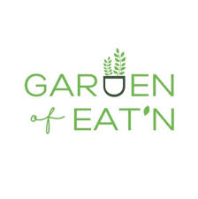
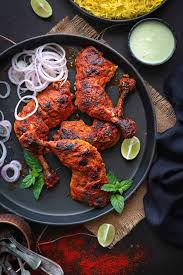
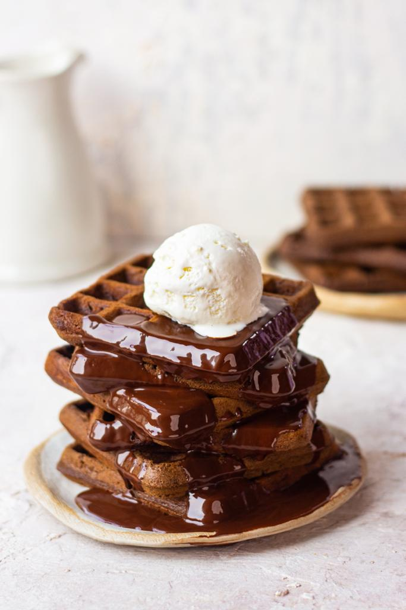

# Ex.07 Restaurant Website
## Date:17-12-2024

## AIM:
To develop a static Restaurant website to display the food items and services provided by them.

## DESIGN STEPS:

### Step 1:
Requirement collection.

### Step 2:
Creating the layout using HTML and CSS.

### Step 3:
Updating the sample content.

### Step 4:
Choose the appropriate style and color scheme.

### Step 5:
Validate the layout in various browsers.

### Step 6:
Validate the HTML code.

### Step 7:
Publish the website in the given URL.

## PROGRAM:
```
<html>
<head>
    <meta charset="UTF-8">
    <meta name="viewport" content="width=device-width, initial-scale=1.0">
    <title>HPDK</title>
</head>
<body>

    <div style="font-size: 40px; color: #050a0d; font-family: 'Gill Sans', 'Gill Sans MT', Calibri, 'Trebuchet MS', sans-serif; text-align: center; background-color: rgb(255, 255, 255); padding: 20px;">
        <h1>The Garden of Eat'n</h1>
        
    </div>

    <nav style="background-color: #639dc6; padding: 10px; text-align: center; font-family: 'Segoe UI', Tahoma, Geneva, Verdana, sans-serif;">
        <ul style= "list-style-type: none; padding: 0; margin: 0;">
            <li style="display: inline; margin-right: 20px;"><a href="#home" style="text-decoration: none; color: white;">Home</a></li>
            <li style="display: inline; margin-right: 20px;"><a href="#about" style="text-decoration: none; color: white;">About</a></li>
            <li style="display: inline; margin-right: 20px;"><a href="#menu" style="text-decoration: none; color: white;">Menu</a></li>
            <li style="display: inline; margin-right: 20px;"><a href="#members" style="text-decoration: none; color: white;">Administration</a></li>
            <li style="display: inline; margin-right: 20px;"><a href="#query" style="text-decoration: none; color: white;">Query</a></li>
            <li style="display: inline; margin-right: 20px;"><a href="#contact" style="text-decoration: none; color: white;">Contact</a></li>
        </ul>
    </nav>

    <section id="home" style="padding: 20px; text-align: center; background-color: rgb(161, 145, 214); font-family: 'Trebuchet MS', 'Lucida Sans Unicode', 'Lucida Grande', 'Lucida Sans', Arial, sans-serif;">
        <h2>Introducing the all new The Garden of Eat'n</h2>
        <p>Welcome to The Garden of Eat'n, where snacking meets innovation and flavor.</p>
        <p>We use only the finest ingredients, carefully sourced to ensure every snack is as wholesome as it is delicious. </p>
        <p>From classic favorites to bold, adventurous blends, our snacks are crafted to excite your taste buds. </p>
        <p>At The Garden of Eat'n, we believe that every bite should be a delightful journey</p>
        <p>"Bringing people together, one plate at a time." </p>
    </section>

    <section id="about" style="padding: 20px; text-align: center; background-color: #87e184; font-family: 'Trebuchet MS', 'Lucida Sans Unicode', 'Lucida Grande', 'Lucida Sans', Arial, sans-serif;">
        <h2>About Us</h2>
        <p>At The Garden of Eat'n, we’re all about bringing joy to every bite! </p>
        <p>We specialize in crafting delicious, high-quality snacks that satisfy cravings and fuel your day.</p>
        <p>Whether you’re on the go, hosting friends, or just indulging in a little treat for yourself, The Garden of Eat'n is here to make every moment more flavorful. </p>
        <p>With a passion for taste and a commitment to excellence, we’re your go-to for snacks that hit the spot.</p>
    </section>

    <section id="menu" style="padding: 20px; text-align: center; background-color: #71a6e3; font-family: 'Trebuchet MS', 'Lucida Sans Unicode', 'Lucida Grande', 'Lucida Sans', Arial, sans-serif;">
        <h2>Signature Dishes</h2>
        <div style="display: flex; justify-content: center; gap: 20px; flex-wrap: wrap;">
            <div style="text-align: left;">
                
                <p>Mutton Biriyani - Rs 550</p>
            </div>
            <div style="text-align: left;">
                
                <p>Tandoori Chicken - Rs 450</p>
            </div>
            <div style="text-align: left;">
                
                <p>Chicken 65 - Rs 175</p>
            </div>
            <div style="text-align: left;">
                
                <p>waffles - Rs 299</p>
            </div>
            <div style="text-align: left;">
                
                <p>Tiramisu - Rs 175</p>
            </div>
          
        </div>
    </section>

    <section id="members" style="padding: 20px; text-align: center; font-family: 'Trebuchet MS', 'Lucida Sans Unicode', 'Lucida Grande', 'Lucida Sans', Arial, sans-serif;">
        <h2>Our Crew Members</h2>
        <div style="display: flex; justify-content: center; gap: 20px; flex-wrap: wrap;">
            <div style="text-align: center;">
                
                <p>DHANUS KARTHI - Founder</p>
            </div>
            <div style="text-align: center;">
                
                <p>Madampatti rangaraj - cheif chef</p>
            </div>
            <div style="text-align: center;">
                
                <p>vikas khanna - Chef</p>
            </div>
            <div style="text-align: center;">
                
                <p>michelin star- Our Executive Chef</p>
            </div>
            <div style="text-align: center;">
                
                <p>Gordon Ramsay - Our Executive Chef</p>
            </div>
        </div>
    </section>

    <section id="query" style="padding: 20px; text-align: center; font-family: 'Trebuchet MS', 'Lucida Sans Unicode', 'Lucida Grande', 'Lucida Sans', Arial, sans-serif; background-color: #4a3d26; color: white;">
        <h2>Any Query</h2>
        <p>Inform us your feedback and queries here</p>
        <form action="#" style="text-align: center;">
            <input type="name" placeholder="Your Name" style="padding: 5px; margin: 5px;"><br>
            <textarea placeholder="Your Query" rows="4" style="padding: 5px; margin: 5px;"></textarea><br>
            <button type="submit" style="padding: 10px 20px; background-color: #343029; color: white; border: none; cursor: pointer;">Submit</button>
        </form>
    </section>

    <section id="contact" style="padding: 20px; text-align: center; background-color: #090a0b; color: rgb(155, 104, 225); font-family: 'Trebuchet MS', 'Lucida Sans Unicode', 'Lucida Grande', 'Lucida Sans', Arial, sans-serif;">
        <h2>Contact Us</h2>
        <p>Have questions or Want to book a table? </p>
        <p>Our email - dhanuskarthi24@gmail.com</p>
        <p>Our telephone - +91 9047385377</p>
    </section>

    <div style="font-size: 15xpx; text-align: bottom; background-color: rgb(183, 209, 229); padding: 20px; font-family: 'Trebuchet MS', 'Lucida Sans Unicode', 'Lucida Grande', 'Lucida Sans', Arial, sans-serif;">
        <p>Designed and Developed by DHANUS KARTHI[24005701]</p>
    </div>

</body>
</html>
```


## OUTPUT:


## RESULT:
The program for designing software company website using HTML and CSS is completed successfully.
